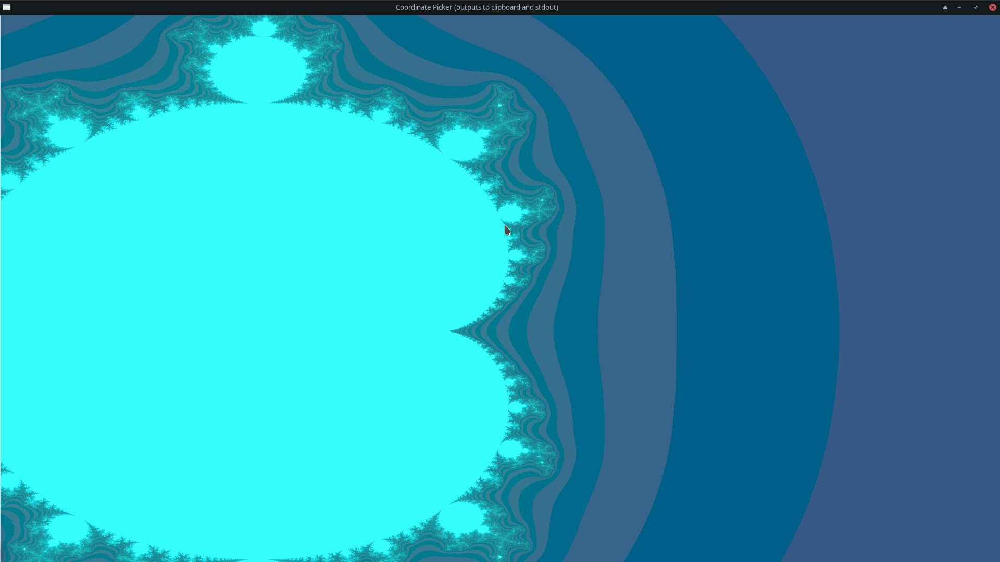

# Fractal Toolkit
Render, select coordinates, export to video and more.

There are python docstrings for pretty much everything, so if you want help or documentation on a particular function, python's help() command will work.

Here is an example fractal that I generated. You can also make videos that can be exported as gifs.

The function used for this one was the hailstorm3 function listed as one of the examples somewhere below in this document.

## Rendering Fractals
Not a comprehensive guide, but this should get you up to speed:
First, you will need a fuction to calculate your fractal. Here is one for the mandelbrot set:

```python
import numpy as np
import fractalrenderer

def mandelbrot(c, max_iter):
    """sample fractal function that can be used to render the mandelbrot set"""
    z = c
    oldz = z
    depths = np.zeros_like(z, dtype=np.float64) + max_iter
    upper_threshold = 9e23
    for n in range(max_iter):
        oldz = z
        depths[(depths == max_iter) & (abs(z) > upper_threshold)] = n
        z = z*z + c

    color1 = abs(255 - 255/(np.exp(z.real/50) + 1)) #inside/outside
    color2 = abs(255 - 255/(np.exp(z.imag/50) + 1)) #inside/outside
    color3 = abs((depths % 2) * 54) #solid bands around pattern
    color4 = abs(np.log(depths)*255/np.log(max_iter+2)) #gradient bands around pattern
    color5 = abs(z-oldz) % 2 * 54 # distance from center inside pattern
    color6 = abs(255 - 255/(np.exp(abs(depths)/50) + 1)) #distance from pattern
    return [color3, color4, color6]
```

Make sure this script is in the same directory as fractalrenderer.py. You can also use the built-in convenience function fractalrenderer.mandelbrot which is more or less the same.

The function to use to render the fractal should take c (input coordinate where c.real is x and c.imag is y) and max_iter as arguments and return [red, green, blue] where each color value is 0 to 255. You can make up whatever function you want.

Choose what parts of the fractal you wish to render. I will go with an animation starting and ending on the coordinate (0.36, 0.1) with a viewport of dimensions 2x1.6 than shrinks by a tenth of the size over the course of the animation. I will have ten frames of animation just for demonstration. It is good practice to use way fewer frames than you need when starting out because it is usually neccessary to adjust things multiple times before the final render. 
```python
xmins, xmaxs, ymins, ymaxs = fractalrenderer.create_zoom_viewports(0.36, 0.1, 0.36, 0.1, 2, 0.02, 1.6, 0.016, 10)
```
Choose your final image/video size (in this case 1920x1080) and number of maximum iterations you would like to pass to your fractal functions (more iterations will give a sharper result; 255 is a reasonable number here). This line will render the fractals as an image sequence using 10 threads to a the directory "anims/mandelbrot/"
```python
fractalrenderer.process_steps_multithreaded(xmins, xmaxs, ymins, ymaxs, 1920, 1080, 255, 10, mandelbrot, 10, True, "anims")
```

After running the script, check the directory to make sure you like the images.
If you want to adjust the viewport position, you can use the coordpicker.py tool to pick coordinates from one of the images using the mouse. It just copies them to clipboard and spits them out on stdout.
```bash
python3 coordpicker.py anims/mandelbrot/desired_frame.png
```
It should look like this when picking coordinates, and output something like this when clicked

```
pixelx=968, pixely=400
0.3683333333333333 + 0.30740740740740746j
```

Once everything is to your liking, you can convert the image sequence to video with either blender or assembleanimfromimages.py.
```bash
python3 assembleanimfromimages.py anims/mandelbrot mandelbrot.avi
```

Enjoy!

### Further Examples

```python
def hailstorm3(c, max_iter):
    n = c
    oldn = n
    depths = np.zeros(n.shape) + 1
    for v in range(max_iter):
        '''
        if abs(n) == 1:
            return [129, 129, 0]
        if abs(n) > 1e10:
            return [200, 200, 200]
        '''
        oldn = n
        n = n/2 + (5*n/2 + 1)*np.sin(np.pi*n/2)**2
        depths[np.logical_and(np.isnan(n), depths == 1)] = v + 2
        #n = n/2 - (5*n/2+1)*(np.e**(0.5j*np.pi*n) - np.e**(-0.5j*np.pi*n))**2/4
    #r, i = n.as_real_imag()
    #n = np.nan_to_num(n)
    return [255 - 255/(np.exp(n.real/50) + 1), (depths % 2) * 54, np.log(depths)*255/np.log(max_iter+2)]
```
